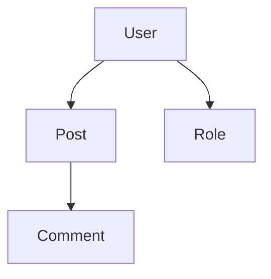

# Output Formats

Laravel Devtoolbox supports multiple output formats to accommodate different use cases, from human-readable console output to machine-processable structured data.

## Available Formats

### Array/Table Format (Default)

The default format provides human-readable output in the console, typically displayed as tables or structured text.

```bash
php artisan dev:models
# or explicitly
php artisan dev:models --format=array
```

**Best for:**
- Interactive development
- Quick inspections
- Console-based workflows

**Example output:**
```
Found 5 models:

📄 App\Models\User
   File: app/Models/User.php
   Relationships: posts, roles

📄 App\Models\Post
   File: app/Models/Post.php
   Relationships: user, comments
```

### JSON Format

Structured JSON output perfect for programmatic processing and integration with other tools.

```bash
php artisan dev:models --format=json
```

**Best for:**
- CI/CD pipelines
- API integrations
- Data processing scripts
- Automated analysis

**Example output:**
```json
{
  "type": "models",
  "timestamp": "2024-01-15T10:30:00.000000Z",
  "data": [
    {
      "class": "App\\Models\\User",
      "file": "app/Models/User.php",
      "relationships": {
        "posts": {
          "type": "hasMany",
          "related": "App\\Models\\Post"
        }
      }
    }
  ]
}
```

### Count Format

Returns only the count of items, useful for quick metrics and CI checks.

```bash
php artisan dev:routes:unused --format=count
```

**Best for:**
- Quick metrics
- CI/CD threshold checks
- Monitoring scripts

**Example output:**
```json
{
  "type": "routes",
  "timestamp": "2024-01-15T10:30:00.000000Z",
  "count": 3,
  "message": "Found 3 unused routes"
}
```

### Mermaid Format

Generates Mermaid diagram syntax for visualization of relationships and flows.

```bash
php artisan dev:model:graph --format=mermaid
```

**Best for:**
- Documentation generation
- Visual representation
- Architecture diagrams
- README files

**Example output:**


## Format-Specific Options

### JSON Format Options

Configure JSON output in `config/devtoolbox.php`:

```php
'output' => [
    'formats' => [
        'json' => [
            'pretty_print' => true,        // Readable formatting
            'escape_unicode' => false,     // Keep unicode characters
        ],
    ],
],
```

### Mermaid Format Options

```php
'output' => [
    'formats' => [
        'mermaid' => [
            'direction' => 'TB',           // TB, BT, LR, RL
            'theme' => 'default',          // Mermaid theme
        ],
    ],
],
```

Supported directions:
- `TB` - Top to Bottom
- `BT` - Bottom to Top  
- `LR` - Left to Right
- `RL` - Right to Left

## Saving Output to Files

All formats can be saved to files using the `--output` option:

```bash
# Save JSON to file
php artisan dev:models --format=json --output=models.json

# Save Mermaid diagram
php artisan dev:model:graph --format=mermaid --output=models.mmd

# Save to custom location
php artisan dev:scan --all --output=/tmp/full-scan.json
```

## Format Usage by Command

| Command | Array | JSON | Count | Mermaid |
|---------|-------|------|-------|---------|
| `dev:scan` | ✅ | ✅ | ✅ | ❌ |
| `dev:models` | ✅ | ✅ | ✅ | ❌ |
| `dev:model:where-used` | ✅ | ✅ | ✅ | ❌ |
| `dev:model:graph` | ❌ | ✅ | ❌ | ✅ |
| `dev:routes` | ✅ | ✅ | ✅ | ❌ |
| `dev:routes:unused` | ✅ | ✅ | ✅ | ❌ |
| `dev:commands` | ✅ | ✅ | ✅ | ❌ |
| `dev:services` | ✅ | ✅ | ✅ | ❌ |
| `dev:middleware` | ✅ | ✅ | ✅ | ❌ |
| `dev:views` | ✅ | ✅ | ✅ | ❌ |
| `dev:db:column-usage` | ✅ | ✅ | ❌ | ❌ |
| `dev:security:unprotected-routes` | ✅ | ✅ | ❌ | ❌ |
| `dev:sql:trace` | ✅ | ✅ | ❌ | ❌ |
| `dev:env:diff` | ✅ | ✅ | ❌ | ❌ |

## Data Structure

### Standard Response Format

All commands return data in a consistent structure:

```json
{
  "type": "scanner_type",
  "timestamp": "2024-01-15T10:30:00.000000Z",
  "options": {
    "format": "json",
    "custom_option": "value"
  },
  "data": {
    // Scanner-specific data
  },
  "metadata": {
    "scan_duration": "0.5s",
    "memory_usage": "45MB",
    "files_scanned": 125
  }
}
```

### Scanner-Specific Data Formats

#### Models Scanner
```json
{
  "data": [
    {
      "class": "App\\Models\\User",
      "file": "app/Models/User.php",
      "namespace": "App\\Models",
      "relationships": {
        "posts": {
          "type": "hasMany",
          "related": "App\\Models\\Post",
          "foreign_key": "user_id"
        }
      },
      "attributes": ["id", "name", "email"],
      "scopes": ["active", "verified"]
    }
  ]
}
```

#### Routes Scanner
```json
{
  "data": [
    {
      "uri": "users/{user}",
      "name": "users.show",
      "methods": ["GET", "HEAD"],
      "controller": "App\\Http\\Controllers\\UserController@show",
      "middleware": ["web", "auth"],
      "parameters": ["user"]
    }
  ]
}
```

#### SQL Trace Scanner
```json
{
  "data": {
    "traced_target": "users.index",
    "method": "GET",
    "total_queries": 5,
    "total_time": 23.45,
    "queries": [
      {
        "sql": "SELECT * FROM users WHERE active = ?",
        "bindings": [1],
        "time": 12.34,
        "connection": "mysql"
      }
    ],
    "statistics": {
      "average_time": 4.69,
      "max_time": 12.34,
      "min_time": 0.15,
      "query_types": {
        "SELECT": 4,
        "UPDATE": 1
      }
    }
  }
}
```

## Integration Examples

### CI/CD Integration

```bash
#!/bin/bash
# Check for unused routes in CI
UNUSED_COUNT=$(php artisan dev:routes:unused --format=count | jq '.count')
if [ $UNUSED_COUNT -gt 10 ]; then
    echo "Too many unused routes: $UNUSED_COUNT"
    exit 1
fi
```

### Documentation Generation

```bash
#!/bin/bash
# Generate documentation
php artisan dev:models --format=json --output=docs/models.json
php artisan dev:model:graph --format=mermaid --output=docs/models.mmd
php artisan dev:routes --format=json --output=docs/routes.json
```

### Monitoring Script

```bash
#!/bin/bash
# Daily application health check
DATE=$(date +%Y%m%d)
php artisan dev:scan --all --format=json --output="reports/scan-$DATE.json"
```

## Best Practices

### Choosing the Right Format

1. **Array/Table** - For interactive development and debugging
2. **JSON** - For automation, CI/CD, and data processing
3. **Count** - For quick metrics and threshold checking
4. **Mermaid** - For documentation and visual representation

### File Organization

```bash
# Organize output files by date and type
mkdir -p reports/$(date +%Y%m%d)
php artisan dev:scan models --format=json --output="reports/$(date +%Y%m%d)/models.json"
php artisan dev:scan routes --format=json --output="reports/$(date +%Y%m%d)/routes.json"
```

### Automated Processing

```bash
# Process JSON output with jq
php artisan dev:models --format=json | jq '.data[] | select(.relationships | length > 5)'

# Count specific items
php artisan dev:routes --format=json | jq '.data | map(select(.middleware | contains(["auth"]))) | length'
```

## Troubleshooting

### JSON Parsing Issues
Ensure your output is valid JSON by piping through `jq`:
```bash
php artisan dev:models --format=json | jq '.'
```

### Large File Sizes
For large applications, consider using compression:
```bash
php artisan dev:scan --all --format=json | gzip > scan.json.gz
```

### Memory Issues with JSON
Use streaming JSON parsers for very large outputs, or process data in chunks.