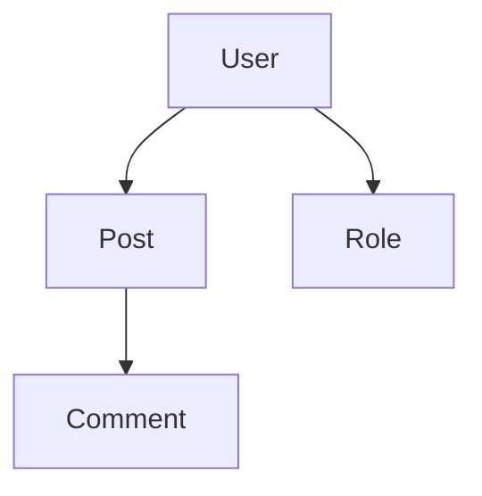

# Output Formats

Laravel Devtoolbox supports multiple output formats to accommodate different use cases, from human-readable console output to machine-processable structured data.

## Available Formats

### Array/Table Format (Default)

The default format provides human-readable output in the console, typically displayed as tables or structured text.

```bash
php artisan dev:models
# or explicitly
php artisan dev:models --format=array
```

**Best for:**
- Interactive development
- Quick inspections
- Console-based workflows

**Example output:**
```
Found 5 models:

📄 App\Models\User
   File: app/Models/User.php
   Relationships: posts, roles

📄 App\Models\Post
   File: app/Models/Post.php
   Relationships: user, comments
```

### JSON Format

Structured JSON output perfect for programmatic processing and integration with other tools.

```bash
php artisan dev:models --format=json
```

**Best for:**
- CI/CD pipelines
- API integrations
- Data processing scripts
- Automated analysis

**Example output:**
```json
{
  "type": "models",
  "timestamp": "2024-01-15T10:30:00.000000Z",
  "data": [
    {
      "class": "App\\Models\\User",
      "file": "app/Models/User.php",
      "relationships": {
        "posts": {
          "type": "hasMany",
          "related": "App\\Models\\Post"
        }
      }
    }
  ]
}
```

### Count Format

Returns only the count of items, useful for quick metrics and CI checks.

```bash
php artisan dev:routes:unused --format=count
```

**Best for:**
- Quick metrics
- CI/CD threshold checks
- Monitoring scripts

**Example output:**
```json
{
  "type": "routes",
  "timestamp": "2024-01-15T10:30:00.000000Z",
  "count": 3,
  "message": "Found 3 unused routes"
}
```

### Mermaid Format

Generates Mermaid diagram syntax for visualization of relationships and flows.

```bash
php artisan dev:model:graph --format=mermaid
```

**Best for:**
- Documentation generation
- Visual representation
- Architecture diagrams
- README files

**Example output:**


## Format-Specific Options

### JSON Format Options

Configure JSON output in `config/devtoolbox.php`:

```php
'output' => [
    'formats' => [
        'json' => [
            'pretty_print' => true,        // Readable formatting
            'escape_unicode' => false,     // Keep unicode characters
        ],
    ],
],
```

### Mermaid Format Options

```php
'output' => [
    'formats' => [
        'mermaid' => [
            'direction' => 'TB',           // TB, BT, LR, RL
            'theme' => 'default',          // Mermaid theme
        ],
    ],
],
```

Supported directions:
- `TB` - Top to Bottom
- `BT` - Bottom to Top  
- `LR` - Left to Right
- `RL` - Right to Left

## Saving Output to Files

All formats can be saved to files using the `--output` option:

```bash
# Save JSON to file
php artisan dev:models --format=json --output=models.json

# Save Mermaid diagram
php artisan dev:model:graph --format=mermaid --output=models.mmd

# Save to custom location
php artisan dev:scan --all --output=/tmp/full-scan.json
```

## Format Usage by Command

| Command | Array | JSON | Count | Mermaid | Table |
|---------|-------|------|-------|---------|-------|
| `dev:scan` | ✅ | ✅ | ✅ | ❌ | ✅ |
| `dev:about+` | ❌ | ✅ | ❌ | ❌ | ✅ |
| `dev:models` | ✅ | ✅ | ✅ | ❌ | ✅ |
| `dev:model:where-used` | ✅ | ✅ | ✅ | ❌ | ✅ |
| `dev:model:graph` | ❌ | ✅ | ❌ | ✅ | ❌ |
| `dev:routes` | ✅ | ✅ | ✅ | ❌ | ✅ |
| `dev:routes:unused` | ✅ | ✅ | ✅ | ❌ | ✅ |
| `dev:routes:where` | ❌ | ✅ | ❌ | ❌ | ✅ |
| `dev:commands` | ✅ | ✅ | ✅ | ❌ | ✅ |
| `dev:services` | ✅ | ✅ | ✅ | ❌ | ✅ |
| `dev:container:bindings` | ❌ | ✅ | ❌ | ❌ | ✅ |
| `dev:providers:timeline` | ❌ | ✅ | ✅ | ❌ | ✅ |
| `dev:middleware` | ✅ | ✅ | ✅ | ❌ | ✅ |
| `dev:middlewares:where-used` | ❌ | ✅ | ❌ | ❌ | ✅ |
| `dev:views` | ✅ | ✅ | ✅ | ❌ | ✅ |
| `dev:db:column-usage` | ❌ | ✅ | ❌ | ❌ | ✅ |
| `dev:security:unprotected-routes` | ❌ | ✅ | ❌ | ❌ | ✅ |
| `dev:sql:trace` | ❌ | ✅ | ❌ | ❌ | ✅ |
| `dev:sql:duplicates` | ❌ | ✅ | ❌ | ❌ | ✅ |
| `dev:env:diff` | ✅ | ✅ | ❌ | ❌ | ✅ |
| `dev:log:tail` | ❌ | ✅ | ❌ | ❌ | ✅ |

## Data Structure

### Standard Response Format

All commands return data in a consistent structure:

```json
{
  "type": "scanner_type",
  "timestamp": "2024-01-15T10:30:00.000000Z",
  "options": {
    "format": "json",
    "custom_option": "value"
  },
  "data": {
    // Scanner-specific data
  },
  "metadata": {
    "scan_duration": "0.5s",
    "memory_usage": "45MB",
    "files_scanned": 125
  }
}
```

### Scanner-Specific Data Formats

#### Models Scanner
```json
{
  "data": [
    {
      "class": "App\\Models\\User",
      "file": "app/Models/User.php",
      "namespace": "App\\Models",
      "relationships": {
        "posts": {
          "type": "hasMany",
          "related": "App\\Models\\Post",
          "foreign_key": "user_id"
        }
      },
      "attributes": ["id", "name", "email"],
      "scopes": ["active", "verified"]
    }
  ]
}
```

#### Routes Scanner
```json
{
  "data": [
    {
      "uri": "users/{user}",
      "name": "users.show",
      "methods": ["GET", "HEAD"],
      "controller": "App\\Http\\Controllers\\UserController@show",
      "middleware": ["web", "auth"],
      "parameters": ["user"]
    }
  ]
}
```

#### SQL Trace Scanner
```json
{
  "data": {
    "traced_target": "users.index",
    "method": "GET",
    "total_queries": 5,
    "total_time": 23.45,
    "queries": [
      {
        "sql": "SELECT * FROM users WHERE active = ?",
        "bindings": [1],
        "time": 12.34,
        "connection": "mysql"
      }
    ],
    "statistics": {
      "average_time": 4.69,
      "max_time": 12.34,
      "min_time": 0.15,
      "query_types": {
        "SELECT": 4,
        "UPDATE": 1
      }
    }
  }
}
```

#### SQL Duplicates Scanner (NEW!)
```json
{
  "data": {
    "route": "users.index",
    "method": "GET",
    "threshold": 2,
    "total_queries": 12,
    "unique_queries": 8,
    "duplicate_queries": 4,
    "duplicates": [
      {
        "query": "SELECT * FROM posts WHERE user_id = ?",
        "count": 5,
        "total_time": 45.2,
        "avg_time": 9.04,
        "problem_type": "N+1",
        "recommendation": "Use eager loading with ->with('posts')"
      }
    ],
    "explained_queries": [
      {
        "query": "SELECT * FROM posts WHERE user_id = ?",
        "explain": "Using where; Using index"
      }
    ]
  }
}
```

#### Container Bindings Scanner (NEW!)
```json
{
  "data": [
    {
      "abstract": "App\\Services\\UserService",
      "concrete": "App\\Services\\UserService",
      "shared": true,
      "type": "singleton",
      "resolved": true,
      "aliases": ["user.service"],
      "constructor_parameters": [
        {
          "name": "repository",
          "type": "App\\Repositories\\UserRepository",
          "optional": false
        }
      ]
    }
  ]
}
```

#### Provider Timeline Scanner (NEW!)
```json
{
  "data": [
    {
      "name": "App\\Providers\\AppServiceProvider",
      "type": "ServiceProvider",
      "boot_time": 45.2,
      "register_time": 12.1,
      "deferred": false,
      "dependencies": ["EventServiceProvider"],
      "bindings": [
        "App\\Services\\CustomService",
        "custom.service"
      ]
    }
  ]
}
```

#### Enhanced About Command (NEW!)
```json
{
  "data": {
    "environment": {
      "app_name": "Laravel Application",
      "app_env": "local",
      "app_debug": true,
      "app_version": "1.0.0"
    },
    "performance": {
      "memory_limit": "512M",
      "execution_time_limit": "60s",
      "opcache_enabled": true,
      "php_version": "8.3.0"
    },
    "security": {
      "app_key_set": true,
      "debug_mode": true,
      "https_enabled": false,
      "csrf_protection": true
    },
    "database": {
      "connections": ["mysql", "sqlite"],
      "default_connection": "mysql",
      "migration_status": "up_to_date"
    }
  }
}
```

#### Log Tail Scanner (NEW!)
```json
{
  "data": {
    "file": "laravel.log",
    "lines": [
      {
        "timestamp": "2024-01-15 10:30:00",
        "level": "ERROR",
        "message": "Database connection failed",
        "context": {
          "exception": "PDOException",
          "file": "DatabaseConnector.php",
          "line": 45
        }
      }
    ],
    "filters": {
      "level": "error",
      "pattern": null,
      "follow": false
    },
    "stats": {
      "total_lines": 50,
      "filtered_lines": 3,
      "log_size": "2.5MB"
    }
  }
}
```

## Integration Examples

### CI/CD Integration (ENHANCED!)

```bash
#!/bin/bash
# Enhanced CI/CD checks with new commands

# Check for unused routes
UNUSED_COUNT=$(php artisan dev:routes:unused --format=count | jq '.count')
if [ $UNUSED_COUNT -gt 10 ]; then
    echo "Too many unused routes: $UNUSED_COUNT"
    exit 1
fi

# Check for N+1 problems in critical routes (NEW!)
CRITICAL_ROUTES=("dashboard" "users.index" "api.orders")
for route in "${CRITICAL_ROUTES[@]}"; do
    if ! php artisan dev:sql:duplicates --route=$route --threshold=1 --format=json >/dev/null 2>&1; then
        echo "N+1 problems detected in route: $route"
        exit 1
    fi
done

# Check service provider performance (NEW!)
SLOW_PROVIDERS=$(php artisan dev:providers:timeline --slow-threshold=200 --format=count | jq '.slow_count // 0')
if [ $SLOW_PROVIDERS -gt 5 ]; then
    echo "Too many slow service providers: $SLOW_PROVIDERS"
    exit 1
fi

echo "All enhanced CI checks passed"
```

### Documentation Generation (ENHANCED!)

```bash
#!/bin/bash
# Enhanced documentation generation with new commands

# Basic application structure
php artisan dev:models --format=json --output=docs/models.json
php artisan dev:model:graph --format=mermaid --output=docs/models.mmd
php artisan dev:routes --format=json --output=docs/routes.json

# Enhanced application overview (NEW!)
php artisan dev:about+ --extended --performance --security --format=json --output=docs/about.json

# Container and service analysis (NEW!)
php artisan dev:container:bindings --show-resolved --format=json --output=docs/container.json
php artisan dev:providers:timeline --include-deferred --show-dependencies --format=json --output=docs/providers.json

# Controller route mappings (NEW!)
CONTROLLERS=("UserController" "ApiController" "AdminController")
mkdir -p docs/controllers
for controller in "${CONTROLLERS[@]}"; do
    php artisan dev:routes:where "$controller" --format=json --output="docs/controllers/$controller.json" 2>/dev/null || true
done

echo "Enhanced documentation generated"
```

### Monitoring Script (ENHANCED!)

```bash
#!/bin/bash
# Enhanced daily application health monitoring

DATE=$(date +%Y%m%d)
mkdir -p reports/$DATE

# Basic scans
php artisan dev:scan --all --format=json --output="reports/$DATE/scan.json"

# Enhanced monitoring (NEW!)
php artisan dev:about+ --extended --performance --format=json --output="reports/$DATE/about.json"
php artisan dev:providers:timeline --slow-threshold=100 --format=json --output="reports/$DATE/providers.json"
php artisan dev:container:bindings --format=json --output="reports/$DATE/container.json"

# SQL performance monitoring for critical routes (NEW!)
ROUTES=("dashboard" "api.users" "reports.daily")
mkdir -p reports/$DATE/sql
for route in "${ROUTES[@]}"; do
    php artisan dev:sql:duplicates --route=$route --format=json --output="reports/$DATE/sql/$route-n+1.json" 2>/dev/null || true
    php artisan dev:sql:trace --route=$route --format=json --output="reports/$DATE/sql/$route-trace.json" 2>/dev/null || true
done

echo "Enhanced monitoring complete - reports saved to reports/$DATE/"
```

## Best Practices

### Choosing the Right Format

1. **Array/Table** - For interactive development and debugging
2. **JSON** - For automation, CI/CD, and data processing
3. **Count** - For quick metrics and threshold checking
4. **Mermaid** - For documentation and visual representation

### File Organization

```bash
# Organize output files by date and type
mkdir -p reports/$(date +%Y%m%d)
php artisan dev:scan models --format=json --output="reports/$(date +%Y%m%d)/models.json"
php artisan dev:scan routes --format=json --output="reports/$(date +%Y%m%d)/routes.json"
```

### Automated Processing (ENHANCED!)

```bash
# Process JSON output with jq - Basic examples
php artisan dev:models --format=json | jq '.data[] | select(.relationships | length > 5)'

# Count specific items
php artisan dev:routes --format=json | jq '.data | map(select(.middleware | contains(["auth"]))) | length'

# Advanced processing with new commands
# Find controllers with most routes (NEW!)
php artisan dev:routes --format=json | jq '.data | group_by(.controller) | map({controller: .[0].controller, routes: length}) | sort_by(.routes) | reverse | .[0:5]'

# Analyze N+1 problems (NEW!)
php artisan dev:sql:duplicates --route=users.index --format=json | jq '.data.duplicates[] | {query: .query, count: .count, problem: .problem_type}'

# Find slow service providers (NEW!)
php artisan dev:providers:timeline --format=json | jq '.data[] | select(.boot_time > 100) | {provider: .name, boot_time: .boot_time}'

# Container binding analysis (NEW!)
php artisan dev:container:bindings --format=json | jq '.data | group_by(.type) | map({type: .[0].type, count: length})'

# Find middleware usage patterns (NEW!)
php artisan dev:middlewares:where-used auth --format=json | jq '.usage | {routes: (.routes | length), groups: (.groups | length)}'

# Log analysis patterns (NEW!)
php artisan dev:log:tail --lines=1000 --level=error --format=json | jq '.data.lines[] | select(.message | contains("database")) | .timestamp'
```

## Troubleshooting

### JSON Parsing Issues
Ensure your output is valid JSON by piping through `jq`:
```bash
php artisan dev:models --format=json | jq '.'
```

### Large File Sizes
For large applications, consider using compression:
```bash
php artisan dev:scan --all --format=json | gzip > scan.json.gz
```

### Memory Issues with JSON
Use streaming JSON parsers for very large outputs, or process data in chunks.