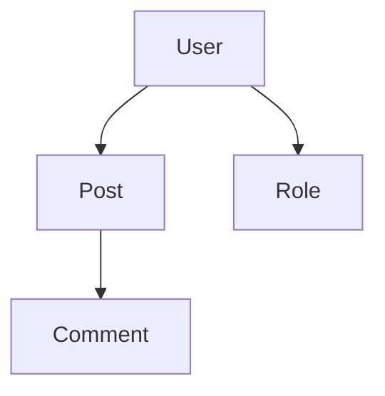

# Output Samples Directory

This directory contains sample outputs from Laravel Devtoolbox commands in various formats to help you understand the data structure and plan your automation.

## Available Samples

### `models.json`
**Command:** `php artisan dev:models --format=json`  
**Description:** Complete model analysis with relationships, attributes, and metadata

**Key Features:**
- Model class information and file paths
- Detailed relationship definitions (hasMany, belongsTo, etc.)
- Fillable, hidden, and cast attributes
- Query scopes and traits
- Comprehensive metadata

**Use Cases:**
- Generate model documentation
- Analyze relationship complexity
- Validate model structure
- Create architecture diagrams

### `model-relationships.mmd`
**Command:** `php artisan dev:model:graph --format=mermaid`  
**Description:** Mermaid diagram showing model relationships

**Key Features:**
- Visual representation of model connections
- Graph syntax compatible with Mermaid
- Can be rendered in documentation tools
- Shows relationship directions

**Use Cases:**
- Documentation generation
- Architecture visualization
- Onboarding new developers
- Code review preparation

### `sql-trace.json`
**Command:** `php artisan dev:sql:trace --route=users.index`  
**Description:** Complete SQL performance analysis for a route

**Key Features:**
- Individual query details with timing
- Performance statistics and analysis
- N+1 query detection
- Slow query identification
- Memory usage tracking
- Cache hit/miss ratios

**Use Cases:**
- Performance optimization
- Query analysis
- Bottleneck identification
- Performance monitoring

## Sample Data Structure

### Models Output Structure
```json
{
  "type": "models",
  "timestamp": "2024-01-15T10:30:00.000000Z",
  "data": [
    {
      "class": "App\\Models\\User",
      "file": "app/Models/User.php",
      "relationships": {
        "posts": {
          "type": "hasMany",
          "related": "App\\Models\\Post"
        }
      },
      "attributes": ["id", "name", "email"],
      "scopes": ["active", "verified"]
    }
  ],
  "metadata": {
    "models_found": 5,
    "total_relationships": 12
  }
}
```

### SQL Trace Output Structure
```json
{
  "type": "sql-trace",
  "data": {
    "traced_target": "users.index",
    "total_queries": 8,
    "total_time": 145.67,
    "queries": [
      {
        "sql": "SELECT * FROM users WHERE active = ?",
        "bindings": [1],
        "time": 23.45,
        "type": "SELECT"
      }
    ],
    "statistics": {
      "average_time": 18.21,
      "max_time": 45.67,
      "query_types": {"SELECT": 7, "UPDATE": 1}
    },
    "performance_insights": {
      "n_plus_one_detected": true,
      "recommendations": ["Consider using eager loading"]
    }
  }
}
```

### Mermaid Diagram Structure


## Processing Examples

### Using jq for JSON Processing

```bash
# Extract model names
jq '.data[].class' models.json

# Find models with many relationships
jq '.data[] | select(.relationships | length > 5)' models.json

# Get slow queries
jq '.data.queries[] | select(.time > 100)' sql-trace.json

# Calculate average query time
jq '.data.statistics.average_time' sql-trace.json
```

### Converting to Other Formats

```bash
# Convert to CSV
jq -r '.data[] | [.class, .file, (.relationships | length)] | @csv' models.json

# Extract for Excel
jq '.data[] | {Model: .class, File: .file, Relationships: (.relationships | length)}' models.json

# Create summary report
jq '{total_models: (.data | length), avg_relationships: ([.data[].relationships | length] | add / length)}' models.json
```

### Integration with Monitoring Tools

```bash
# Prometheus metrics format
echo "laravel_models_total $(jq '.data | length' models.json)"
echo "laravel_unused_routes_total $(jq '.count' unused-routes.json)"

# InfluxDB format
echo "laravel,app=myapp models_count=$(jq '.data | length' models.json)i"
```

## Viewing Mermaid Diagrams

To view the `.mmd` files as visual diagrams:

1. **Online:** Copy content to [Mermaid Live](https://mermaid.live/)
2. **VS Code:** Install the Mermaid Preview extension
3. **GitHub/GitLab:** Native rendering in markdown files
4. **Documentation:** Integrate with GitBook, Notion, or similar tools

## Automation Ideas

### Documentation Generation
```bash
# Auto-update architecture docs
php artisan dev:model:graph --format=mermaid --output=docs/models.mmd
php artisan dev:models --format=json | jq '.data[]' > docs/models-summary.json
```

### Performance Monitoring
```bash
# Daily performance check
php artisan dev:sql:trace --route=dashboard > performance/daily-$(date +%Y%m%d).json

# Alert on slow queries
SLOW_QUERIES=$(jq '.data.slow_queries | length' sql-trace.json)
if [ $SLOW_QUERIES -gt 0 ]; then
    echo "Alert: $SLOW_QUERIES slow queries detected"
fi
```

### Quality Metrics
```bash
# Track code quality over time
echo "$(date),$(jq '.data | length' models.json),$(jq '.count' unused-routes.json)" >> metrics.csv
```

These samples provide a foundation for building your own automation and monitoring solutions with Laravel Devtoolbox.